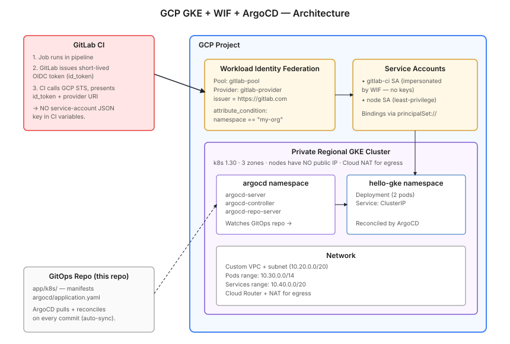

# GCP GKE — Terraform + Workload Identity Federation + ArgoCD

A clean GCP GKE reference: private regional cluster, **keyless GitLab CI authentication via Workload Identity Federation (WIF)**, and ArgoCD for GitOps. No service-account JSON keys anywhere — CI authenticates by exchanging short-lived OIDC tokens.



## What it builds

| Layer | Resources |
|---|---|
| Network | Custom VPC + subnet with secondary ranges for Pods/Services |
| GKE | Private regional cluster (k8s 1.30), single node pool (`e2-medium` × 1 per zone) |
| WIF | Workload Identity Pool + GitLab provider + service account binding |
| IAM | Per-purpose service accounts (cluster nodes, GitLab CI) |
| ArgoCD | Helm-installed in `argocd` namespace, ready for app-of-apps |
| Sample app | Tiny Go web app, deployed via an ArgoCD Application manifest |

## Why WIF matters

Most GitLab→GCP setups still ship a service-account JSON key into a CI variable. That key:
- never expires unless you rotate it,
- is fully visible to anyone with maintainer access on the project,
- is one of the most common credential leaks in cloud security audits.

**Workload Identity Federation eliminates the key entirely.** GitLab's OIDC token is exchanged at the GCP STS endpoint for a short-lived (1-hour) access token. The trust is bound to a specific GitLab project + branch via attribute conditions.

This repo sets up the full pattern from scratch.

## Stack

- Terraform `>= 1.5`, Google provider `~> 5.0`
- Kubernetes `1.30` (GKE Standard, regional, private)
- ArgoCD `v2.11+` (via Helm)
- Region: `europe-west1` (configurable)

## Quick start

```bash
git clone https://github.com/your-username/gcp-gke-terraform-argocd-wif.git
cd gcp-gke-terraform-argocd-wif/terraform

# 1. Set your project ID in terraform.tfvars or via -var
cp terraform.tfvars.example terraform.tfvars
# edit project_id

terraform init
terraform plan
terraform apply

# 2. Get cluster credentials (from a machine with IAP / cluster-network access)
gcloud container clusters get-credentials $(terraform output -raw cluster_name) \
  --region $(terraform output -raw region) \
  --project $(terraform output -raw project_id)

# 3. Verify ArgoCD is up
kubectl get pods -n argocd
```

## How GitLab CI uses WIF (keyless)

After `terraform apply`, copy these into your GitLab CI/CD variables (group level recommended):

```yaml
# .gitlab-ci.yml on the consuming repo
image: google/cloud-sdk:alpine

variables:
  GCP_WORKLOAD_IDENTITY_PROVIDER: "<terraform output -raw wif_provider_name>"
  GCP_SERVICE_ACCOUNT: "<terraform output -raw gitlab_ci_sa_email>"

deploy:
  id_tokens:
    GCP_ID_TOKEN:
      aud: "https://gitlab.com"
  script:
    - |
      gcloud iam workload-identity-pools create-cred-config \
        "$GCP_WORKLOAD_IDENTITY_PROVIDER" \
        --service-account="$GCP_SERVICE_ACCOUNT" \
        --output-file=/tmp/wlif-config.json \
        --credential-source-file=/tmp/oidc.token
      echo "$GCP_ID_TOKEN" > /tmp/oidc.token
      export GOOGLE_APPLICATION_CREDENTIALS=/tmp/wlif-config.json
    - gcloud container clusters get-credentials my-cluster --region europe-west1
    - kubectl apply -f manifests/
```

Zero JSON keys involved. The OIDC token GitLab issues per-job is exchanged at runtime.

## Project structure

```
gcp-gke-terraform-argocd-wif/
├── README.md
├── terraform/
│   ├── main.tf              # Backend, providers
│   ├── variables.tf
│   ├── outputs.tf
│   ├── network.tf           # VPC + subnet + secondary ranges
│   ├── gke.tf               # Private regional cluster + node pool
│   ├── iam.tf               # Service accounts (node SA, CI SA)
│   ├── wif.tf               # WIF pool + GitLab provider + binding
│   ├── argocd.tf            # ArgoCD via Helm (kubernetes_namespace + helm_release)
│   └── terraform.tfvars.example
├── app/                     # Sample Go web app
│   ├── Dockerfile
│   ├── go.mod
│   ├── main.go
│   └── k8s/
│       ├── namespace.yaml
│       ├── deployment.yaml
│       └── service.yaml
├── argocd/
│   └── application.yaml     # ArgoCD Application pointing at this repo's app/k8s/
└── docs/
    └── architecture.svg
```

## What this repo deliberately doesn't include

- ❌ Bastion host / IAP tunneling — assumed your CI runners have cluster network access (or the cluster has a public endpoint with authorized networks)
- ❌ Cloud SQL / Memorystore / GCS — orthogonal, add per workload
- ❌ ArgoCD app-of-apps boilerplate — included a single Application as a demo; you bring your own bootstrap pattern
- ❌ Cloud Armor / Cloud NAT — add when you have specific egress / WAF needs

## Cost estimate

| Resource | Approx. monthly |
|---|---|
| GKE control plane | $73 (free tier covers 1 zonal cluster only — regional always charges) |
| 3× e2-medium nodes (1 per zone) | ~$75 |
| Persistent disk (3× 100 GB pd-standard) | ~$12 |
| Egress (low traffic) | $5–15 |
| **Total** | **~$165–180/month** |

Optimization: switch to `Autopilot` mode (pay per pod-resource, no node management) — often cheaper for low-utilization clusters.

## License

MIT
